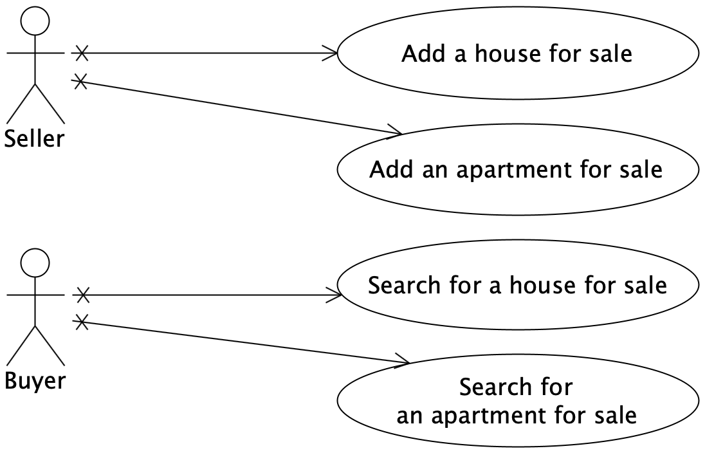
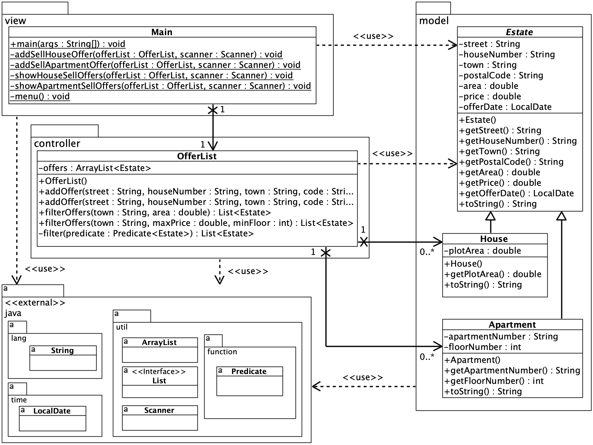
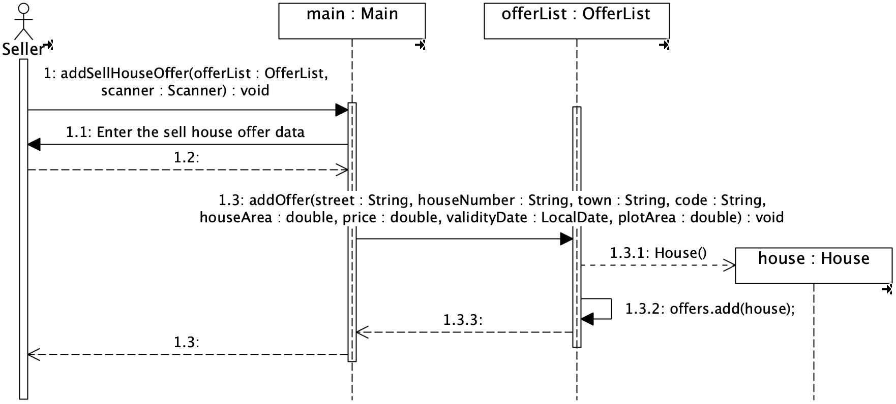
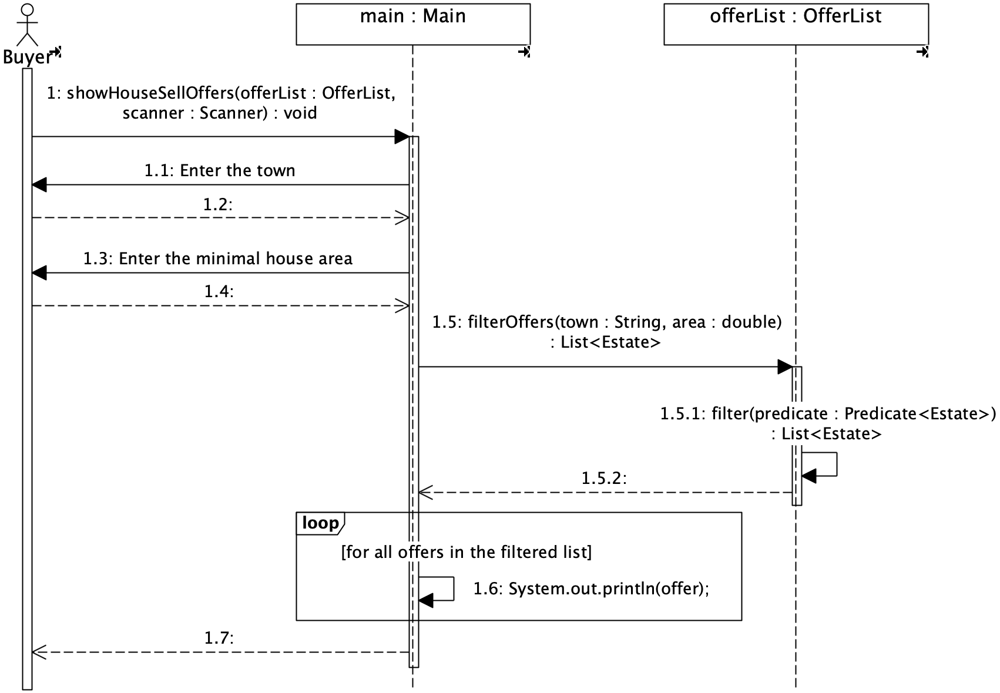

# Estate

The software package for house and apartment sales offers.

## The software functions

The software functions were presented in Unified Modeling Language (UML) Use Case diagram.

The figure below presents the UML Use Case diagram with use cases of the Estate package.

  

## The software structure

The software structure includes three packages: view, controller, and model.

The view package consists of one class: ``Main``.

The controller package encompasses one class: ``OfferList``.

The model package comprises three classes:
* ``Estate`` class --- the abstract class that represents the generic real estate.
* ``House`` class --- a specific class that represents an offer to sell a house.
* ``Apartment`` class --- a concrete class that represents an offer to sell an apartment.

The figure below presents the UML Class diagram with classes and relationships of the Estate package.

  

## The software operation

The figure below presents the UML Sequence diagram for invocation of the ``addSellHouseOffer()`` method. The method corresponds to the ``Add a house for sale`` use case.

  

The figure below presents the UML Sequence diagram for invocation of the ``showHouseSellOffers()`` method. The method corresponds to the ``Search for a house for sale`` use case.

  

## Running the software

The ``Main`` class should be run to execute Estate application. 
